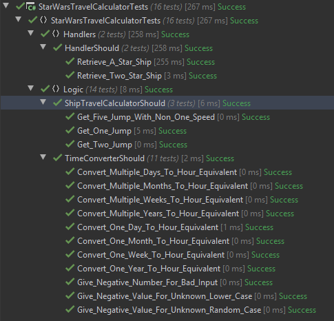
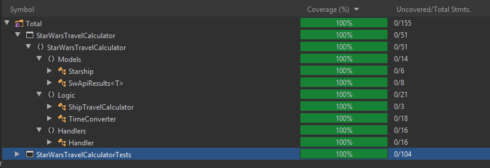

# Star Wars MQLT Travel Calculator

## Introduction

As part of this code challenge you will be using an API available here: [swapi](https://swapi.co/)

We want to know for all SW star ships, to cover a given distance, how many stops for resupply are required.
The application will take as input a distance in mega lights (MGLT).
The output should be a collection of all the star ships and the total amount of stops required to make the distance between the planets.

All other application details are at your own discretion.

Sample output for 1000000 input:

```console
Enter the Distance to travel : 1000000
Y-wing: 74
Millennium Falcon: 9
Rebel Transport: 11
```

## Requirements

The completed Console Application code should be submitted along with

* Accompanying documentation
* Tests I
* Instructions on the usage of the application.

## Getting Started

Code was written in .NET Core 3.1, using [Autofac](https://github.com/autofac/Autofac) for Dependency Injection.
I wrote a suite of unit tests to verify my changes, I used [Moq](https://github.com/moq/moq) to allow mocking of dependencies such as the API calls.
I have a code coverage of 100% when excluding the Rest Service and the program.cs from the analysis (See bottom of ReadMe for screenshots).

## Explanation

Reviewing the [swapi](https://swapi.co/) I found the contract to retrieve all star ships per the requirement. The result was in the below format.

* **starships**
```json
{
	"count": 37,
	"next": "https://swapi.co/api/starships/?page=2",
	"previous": null,
	"results": [
		{
			"name": "Executor",
			"model": "Executor-class star dreadnought",
			"manufacturer": "Kuat Drive Yards, Fondor Shipyards",
			"cost_in_credits": "1143350000",
			"length": "19000",
			"max_atmosphering_speed": "n/a",
			"crew": "279144",
			"passengers": "38000",
			"cargo_capacity": "250000000",
			"consumables": "6 years",
			"hyperdrive_rating": "2.0",
			"MGLT": "40",
			"starship_class": "Star dreadnought",
			"pilots": [],
			"films": [
				"https://swapi.co/api/films/2/",
				"https://swapi.co/api/films/3/"
			],
			"created": "2014-12-15T12:31:42.547000Z",
			"edited": "2017-04-19T10:56:06.685592Z",
			"url": "https://swapi.co/api/starships/15/"
		}
	]}
```

From the above I discovered the following things
* Count represented the total amount of ships I could recieve
* next was a link to the next page
* The response was a pagination response and I would need to make multipe calls to get all results using the next link.
* The results contains a list of star ships, it maxes out at ten per page
* I would need the name, consumables and MGLT to calculate the amount of jumps
* That consumables and MGLT could be "unknown" so I would have to be able to handle this

## Calculations

I know based from verifing that [MGLT](https://starwars.fandom.com/wiki/Megalight) is per hour speed.
I know that the consumables can be n + days|weeks|months|years so I would need to convert this to the hour equivalent.

Some assumptions.

* 24 hours equals 1 day
* 7 days equals 1 week
* 30 days equals 1 month
* 365 days equals 1 year

The calculation for jumps is as follows (Distance) / (Speed * consumablesInHours)
I will also round the value down as for example 4.5 is 4 jumps and half way through current consumables, therefore only four jumps required to travel the complete distance.

Due to star ships having unknown consumables and MGLT the jumps for these will also be unknown.

* **starship jumps**
```console
Enter the Distance to travel : 16546984684
Executor : 7870
Sentinel-class landing craft : 328313
A-wing : 820782
B-wing : 1082351
Republic Cruiser : UNKNOWN
Naboo fighter : UNKNOWN
```

## Conclusions

I could expand on this more. I could look at making the code faster, adding threading. I could expand the code to support the other contracts (people, films, planets, species and vehicles).
I could handle the issue of UNKNOWN with acceptable exceptions and also add logging to the whole application.

## Running Application and Tests
Using git clone the repository to your local.

```console
git clone https://github.com/DownCastAce/StarWarsTravelCalculator.git
```

Then using your preferred IDE ([Visual Studio](https://visualstudio.microsoft.com/), [Rider](https://www.jetbrains.com/rider/), etc) open the solution StarWarsTravelCalculator.sln.
Build the solution and once complete, you can run the code.

Valid input is 0 - n.

To run the unit tests, ensure the both projects are built and then right click on the project StarWarsTravelCalculatorTests and select "Run Unit Tests"

 
